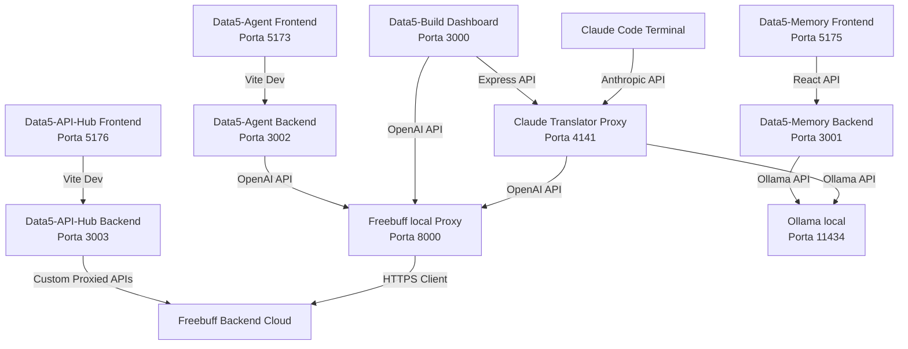

# 🌐 Mapa de Portas, Rotas e Servidores

Este documento mapeia todas as portas de rede local, rotas de API e scripts de inicialização de nossa infraestrutura de desenvolvimento local assistido por IA.

---



---

## ⚡ 1. Claude Grátis (`claude-gratis`)

Ambiente configurado para desviar chamadas do terminal oficial do Claude Code para IAs locais ou gratuitas.

### 🔌 Claude Translator & GUI (`claude-gui.cjs`)
* **Porta:** `4141`
* **URL Local:** `http://localhost:4141`
* **Tipo:** Tradutor Anthropic ➔ OpenAI/Ollama
* **Inicialização:** `iniciar-configurador.bat` (na pasta `claude-gratis`)
* **Descrição:** Abre o painel de configurações no navegador e roda o servidor local que intercepta o Claude Code, traduz as mensagens e as envia para o provedor selecionado.

### 🆓 Proxy do Freebuff (`freebuff2api`)
* **Porta:** `8000`
* **URL Local:** `http://localhost:8000`
* **Rotas principais:**
  * `POST /v1/chat/completions` (OpenAI format)
  * `GET /healthz` (Checagem de integridade)
  * `GET /v1/models` (Modelos disponíveis)
* **Inicialização:** `iniciar-proxy-freebuff.bat` (na pasta `claude-gratis`)
* **Descrição:** Traduz requisições OpenAI para a API interna do Freebuff usando o token de sessão do usuário.

### 🐚 Inicializador do Claude Code
* **Inicialização:** `iniciar-claude.bat`
* **Descrição:** Injeta as variáveis de ambiente necessárias (`ANTHROPIC_BASE_URL=http://localhost:4141`) na sessão e abre o Claude Code pronto para uso via proxy.

---

## 🏗️ 2. Data5-Build

Ambiente de Sandbox local para criar e visualizar aplicações completas de forma iterativa via Chat.

* **Porta:** `3000`
* **URL Local:** `http://localhost:3000`
* **Preview das Aplicações:** `http://localhost:3000/preview/{nome-do-projeto}/index.html`
* **Rotas de API:**
  * `POST /api/chat` (Recebe prompts de criação e delega ao provedor selecionado: Ollama, Freebuff, Gemini ou OpenAI)
  * `GET /api/models` (Busca tags de modelos locais)
  * `GET /api/project/:name` (Lista arquivos do workspace ativo)
  * `POST /api/project/:name/save` (Grava arquivos criados no disco)
* **Inicialização:** `iniciar-data5-build.bat` (na pasta `claude-gratis`)

---

## 🤖 3. Data5-Agent

Orquestração autônoma de subagentes locais (CEO, Programador, Sentinela, Escriba) cooperando em missões.

* **Portas:**
  * **Frontend (Vite):** `5173` (URL: `http://localhost:5173`)
  * **Backend (Express):** `3002` (URL: `http://localhost:3002`)
* **Rotas de API:**
  * `POST /api/chat` (Chat direto com agentes em runAgentChatWithMcpLoop)
  * `POST /api/ai/ceo/run` (Geração e delegação do plano tático da missão)
  * `GET /api/models/:provider` (Retorna a lista de modelos suportados por provedor)
  * `POST /api/workspace/set` (Muda o diretório de arquivos ativo)
  * `POST /api/sync` (Sincroniza metadados locais de memórias e missões com o Supabase Cloud)
* **Inicialização:** `iniciar-antigravity-2.bat` (na pasta `Data5-Agent` do Desktop)

---

## 💾 4. Data5-Memory

Repositório local de memórias, decisões, configurações e notas integrado ao Obsidian, que também expõe um painel visual (Obsidian Clone) no navegador.

* **Portas:**
  * **Frontend (Vite):** `5175` (URL: `http://localhost:5175`)
  * **Backend (Express):** `3001` (URL: `http://localhost:3001`)
* **Cofre Obsidian:** `C:\Users\Nailton\Desktop\Antigravity\Data5-Memory\vault`
* **Rotas de API:**
  * `GET /api/notes` (Retorna a árvore de arquivos e pastas do cofre)
  * `POST /api/notes` (Cria uma nova nota ou pasta)
  * `PUT /api/notes/:id` (Atualiza conteúdo, move ou renomeia arquivos)
  * `DELETE /api/notes/:id` (Remove arquivos fisicamente do disco)
  * `GET /api/ai/models` (Consulta modelos locais no Ollama)
  * `POST /api/ai/complete` (Executa prompts no Ollama local)
* **Scripts de Controle:**
  * **Inicialização:** `start-obsidian.bat` (na pasta `Data5-Memory`)
  * **Parada:** `stop-servers.bat` (na pasta `Data5-Memory`)

---

## 🔌 5. Data5-API-Hub

Banco de dados de credenciais de APIs e Gateway Proxy centralizado com painel de gerenciamento visual.

* **Portas:**
  * **Frontend (Vite):** `5176` (URL: `http://localhost:5176`)
  * **Backend (Express):** `3003` (URL: `http://localhost:3003`)
* **Rotas de API:**
  * `GET /api/providers` (Lista todos os provedores de API cadastrados)
  * `POST /api/providers` (Cadastra ou edita um provedor e suas chaves secretas)
  * `GET /api/apis` (Lista as rotas e endpoints de APIs cadastrados)
  * `POST /api/apis` (Cadastra ou edita uma rota de API)
  * `POST /api/gateway/call/:apiName` (Executa uma requisição proxy injetando chaves, headers e variáveis)
  * `GET /api/logs` (Histórico de requisições enviadas pelo proxy)
* **Scripts de Controle:**
  * **Inicialização:** `iniciar-api-hub.bat` (na pasta central `Bat Iniciar Servidor`)
  * **Parada:** `stop-api-hub.bat` (na pasta central `Bat Iniciar Servidor`)

---
*Nota atualizada automaticamente pelo Antigravity em 06/07/2026.*
```

---

## ⚡ 1. Claude Grátis (`claude-gratis`)

Ambiente configurado para desviar chamadas do terminal oficial do Claude Code para IAs locais ou gratuitas.

### 🔌 Claude Translator & GUI (`claude-gui.cjs`)
* **Porta:** `4141`
* **URL Local:** `http://localhost:4141`
* **Tipo:** Tradutor Anthropic ➔ OpenAI/Ollama
* **Inicialização:** `iniciar-configurador.bat` (na pasta `claude-gratis`)
* **Descrição:** Abre o painel de configurações no navegador e roda o servidor local que intercepta o Claude Code, traduz as mensagens e as envia para o provedor selecionado.

### 🆓 Proxy do Freebuff (`freebuff2api`)
* **Porta:** `8000`
* **URL Local:** `http://localhost:8000`
* **Rotas principais:**
  * `POST /v1/chat/completions` (OpenAI format)
  * `GET /healthz` (Checagem de integridade)
  * `GET /v1/models` (Modelos disponíveis)
* **Inicialização:** `iniciar-proxy-freebuff.bat` (na pasta `claude-gratis`)
* **Descrição:** Traduz requisições OpenAI para a API interna do Freebuff usando o token de sessão do usuário.

### 🐚 Inicializador do Claude Code
* **Inicialização:** `iniciar-claude.bat`
* **Descrição:** Injeta as variáveis de ambiente necessárias (`ANTHROPIC_BASE_URL=http://localhost:4141`) na sessão e abre o Claude Code pronto para uso via proxy.

---

## 🏗️ 2. Data5-Build

Ambiente de Sandbox local para criar e visualizar aplicações completas de forma iterativa via Chat.

* **Porta:** `3000`
* **URL Local:** `http://localhost:3000`
* **Preview das Aplicações:** `http://localhost:3000/preview/{nome-do-projeto}/index.html`
* **Rotas de API:**
  * `POST /api/chat` (Recebe prompts de criação e delega ao provedor selecionado: Ollama, Freebuff, Gemini ou OpenAI)
  * `GET /api/models` (Busca tags de modelos locais)
  * `GET /api/project/:name` (Lista arquivos do workspace ativo)
  * `POST /api/project/:name/save` (Grava arquivos criados no disco)
* **Inicialização:** `iniciar-data5-build.bat` (na pasta `claude-gratis`)

---

## 🤖 3. Data5-Agent

Orquestração autônoma de subagentes locais (CEO, Programador, Sentinela, Escriba) cooperando em missões.

* **Portas:**
  * **Frontend (Vite):** `5173` (URL: `http://localhost:5173`)
  * **Backend (Express):** `3002` (URL: `http://localhost:3002`)
* **Rotas de API:**
  * `POST /api/chat` (Chat direto com agentes em runAgentChatWithMcpLoop)
  * `POST /api/ai/ceo/run` (Geração e delegação do plano tático da missão)
  * `GET /api/models/:provider` (Retorna a lista de modelos suportados por provedor)
  * `POST /api/workspace/set` (Muda o diretório de arquivos ativo)
  * `POST /api/sync` (Sincroniza metadados locais de memórias e missões com o Supabase Cloud)
* **Inicialização:** `iniciar-antigravity-2.bat` (na pasta `Data5-Agent` do Desktop)

---

## 💾 4. Data5-Memory

Repositório local de memórias, decisões, configurações e notas integrado ao Obsidian, que também expõe um painel visual (Obsidian Clone) no navegador.

* **Portas:**
  * **Frontend (Vite):** `5175` (URL: `http://localhost:5175`)
  * **Backend (Express):** `3001` (URL: `http://localhost:3001`)
* **Cofre Obsidian:** `C:\Users\Nailton\Desktop\Antigravity\Data5-Memory\vault`
* **Rotas de API:**
  * `GET /api/notes` (Retorna a árvore de arquivos e pastas do cofre)
  * `POST /api/notes` (Cria uma nova nota ou pasta)
  * `PUT /api/notes/:id` (Atualiza conteúdo, move ou renomeia arquivos)
  * `DELETE /api/notes/:id` (Remove arquivos fisicamente do disco)
  * `GET /api/ai/models` (Consulta modelos locais no Ollama)
  * `POST /api/ai/complete` (Executa prompts no Ollama local)
* **Scripts de Controle:**
  * **Inicialização:** `start-obsidian.bat` (na pasta `Data5-Memory`)
  * **Parada:** `stop-servers.bat` (na pasta `Data5-Memory`)

---
*Nota atualizada automaticamente pelo Antigravity em 03/07/2026.*
