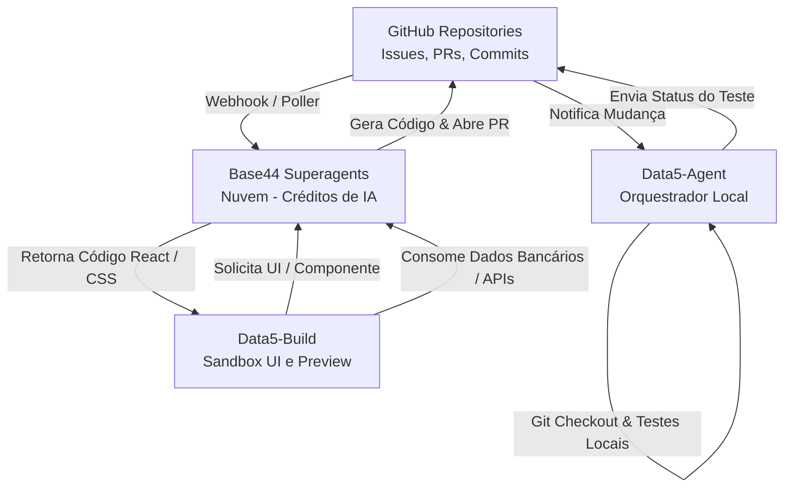

# 🗺️ Planejamento do Ecossistema Base44, GitHub & Data5

Este documento detalha o planejamento arquitetural para integrar os agentes na nuvem da plataforma **Base44** com o repositório **GitHub** e as ferramentas de desenvolvimento locais (**Data5-Agent** e **Data5-Build**), aproveitando a capacidade de superagente e a cota de créditos de IA.

---

## 🎯 Objetivos de Negócio e Engenharia
1. **Redução drástica de custos com IA:** Utilizar os créditos de inteligência dos agentes do Base44 para as tarefas mais pesadas de raciocínio, geração de código e pesquisas.
2. **Automação End-to-End:** Criar um fluxo contínuo onde tarefas no GitHub (issues) acionam correções automáticas de código (pull requests) gerados na nuvem e testados localmente.
3. **Sandbox Visual Conectada:** Permitir que o Data5-Build gere interfaces front-end ricas e responsivas que exibem dados vivos e consolidados pelas integrações de back-end do Base44.

---

## 🏗️ Desenho da Arquitetura

---

## 📋 Divisão de Papéis e Agentes no Base44

Como a plataforma permite criar infinitos agentes, estruturaremos os seguintes agentes trabalhadores especialistas no painel do Base44:

1. **`Base44-Coder` (Programador Sênior)**
   * **Prompt Base:** Especialista em React, Node.js, Tailwind CSS e Vanilla CSS premium. Focado em gerar códigos otimizados, limpos e sem placeholders.
   * **Uso:** Acionado pelo Data5-Build e Data5-Agent para a escrita bruta de arquivos e refatorações complexas.
2. **`Base44-Writer` (Escriba Técnico)**
   * **Prompt Base:** Especialista em documentação técnica e estruturação de conhecimento para o Obsidian (formato markdown).
   * **Uso:** Responsável por redigir diários de bordo, manuais de API e resumos de sessões.
3. **`Base44-Researcher` (Analista de Dados & Web)**
   * **Prompt Base:** Dotado de ferramentas de busca ativa na internet para compilar as melhores soluções de mercado e ler documentações externas atualizadas.
   * **Uso:** Alimentar o processo de planejamento de novos recursos.
4. **`Base44-Finance` (Agente de Saldos e Automações)**
   * **ID:** `69ce6d99e316a867c948f87c`
   * **Prompt Base:** Especialista em ler saldos do IBGR, cruzar dados bancários e rodar fluxos de conciliação.
   * **Uso:** Integrado diretamente ao banco de dados Supabase e à Central Financeira local.

---

## 🔐 Segurança e Acesso
* **GitHub Token:** Será configurado um Fine-grained Personal Access Token (PAT) com escopo restrito de leitura e escrita apenas para os repositórios selecionados da organização Data5. O token será injetado de forma segura no painel do Base44.
* **Comunicação Local-Nuvem:** O `Data5-Agent` local usará a chave `BASE44_API_KEY` guardada no `.env` local para disparar os agentes na nuvem de forma autenticada.

---

## 📅 Roadmap de Implementação

### Fase 1: Fundação & Proxy Local (Próximos Passos)
* [ ] Criar e testar os agentes especialistas (`Base44-Coder`, `Base44-Writer`, `Base44-Researcher`) na plataforma do Base44.
* [ ] Mapear os IDs de todos os agentes no arquivo `.env` do `Data5-Agent` local.
* [ ] Estender o script [base44-agent.js](file:///c:/Users/Nailton/Desktop/Data5-Agent/scripts/base44-agent.js) para receber o tipo do agente como parâmetro e rotear a requisição corretamente.

### Fase 2: Integração com o GitHub
* [ ] Conectar os agentes do Base44 ao repositório de teste do GitHub usando o PAT gerado.
* [ ] Implementar script de escuta (webhook/polling) no `Data5-Agent` local para reagir a alterações de branch e rodar testes de forma automatizada.

### Fase 3: Integração com Data5-Build
* [ ] Adicionar o provedor "Base44" no seletor de modelos da interface do Data5-Build (porta 3000) para criar novos projetos gastando créditos de IA na nuvem.

---
*Nota de planejamento criada pelo Antigravity em 03/07/2026.*
