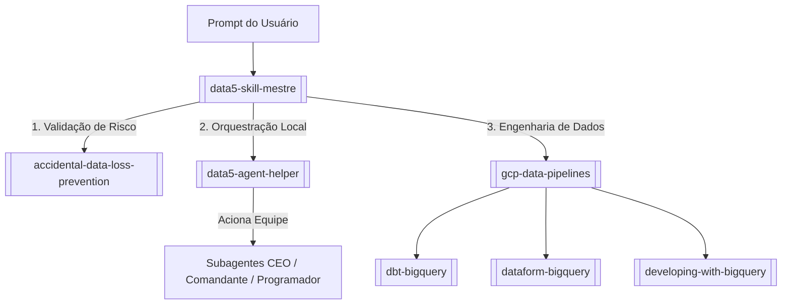

# 🗺️ Mapa de Conexões e Estoque de Skills

Este mapa documenta a arquitetura de habilidades (skills) locais e globais do ecossistema de desenvolvimento de **Nailton Sampaio**. Ele estabelece como os agentes de IA devem se comportar, quais ferramentas devem carregar e como as skills se relacionam entre si.

---

## 🎯 Arquitetura de Roteamento (Fluxo de Decisão)

O ecossistema utiliza a skill mestre `[[data5-skill-mestre]]` como único ponto de entrada para triagem de contexto. O fluxo de carregamento funciona da seguinte forma:

---

## 📂 Inventário do Estoque de Skills

As skills foram catalogadas em três níveis de prioridade e necessidade no Antigravity:

### 🔴 Prioridade 1: Ativas no Antigravity (Fundamentais)
*Estas permanecem ativas na pasta de configuração do Antigravity para uso diário.*

1. **`[[data5-skill-mestre]]`** - Roteador e otimizador de tokens.
2. **`[[data5-agent-helper]]`** - Execução local do Data5-Agent.
3. **`[[accidental-data-loss-prevention]]`** - Guardrail de proteção contra exclusão acidental.
4. **`[[gcp-data-pipelines]]`** - Manual central de pipelines do Google Cloud.
5. **`[[dbt-bigquery]]`** - Modelagem de dados com dbt e SQL.
6. **`[[dataform-bigquery]]`** - Transformação com Dataform (SQLX).
7. **`[[developing-with-bigquery]]`** - Otimização de queries e BigQuery ML.
8. **`[[discovering-gcp-data-assets]]`** - Exploração e descoberta de tabelas GCP.
9. **`[[managing-python-dependencies]]`** - Isolamento de ambientes Virtuais (venv).
10. **`[[notebook-guidance]]`** - Execução de Jupyter Notebooks com BigQuery.

### 🟡 Prioridade 2: Arquivadas no Cofre (Opcionais)
*Removidas do Antigravity global para economizar tokens. Estão documentadas aqui e podem ser reativadas caso o projeto exija.*

* **`[[gcp-pipeline-orchestration]]`** - Orquestração via Apache Airflow/Composer.
* **`[[gcp-composer-troubleshooting]]`** - Resolução de problemas de ambiente Composer.
* **`[[gcp-dataflow]]`** - Pipelines Apache Beam.
* **`[[gcp-spark]]`** - Processamento Spark no Dataproc.
* **`[[gcp-pipeline-resource-provisioning]]`** - Provisionamento declarativo via YAML.
* **`[[bigquery-data-transfer-service]]`** - Ingestão via DTS.
* **`[[data-autocleaning]]`** - Limpeza automatizada de dados.
* **`[[federate-lakehouse-catalog]]`** - Federação com Databricks/AWS Glue.
* **`[[ml-best-practices]]`** - Boas práticas de Machine Learning.
* **`[[building-data-apps]]`** - Criação de Dashboards (Streamlit/Vite).
* **`[[impeccable]]`** - Auditoria de design de interface (UX/UI).
